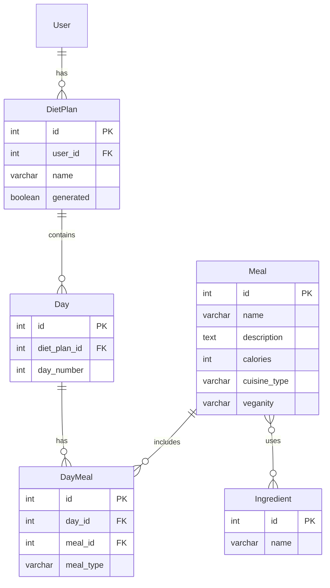

# Dokumentacja

## 1. Dokumentacja API

### 1.1 Uwierzytelnianie

API wykorzystuje system uwierzytelniania oparty na tokenach, aby zapewnić bezpieczny dostęp do niektórych endpointów.
Po pomyślnym zalogowaniu dla każdej sesji użytkownika generowany jest unikalny token. Token ten powinien być zawarty w
nagłówkach
HTTP każdego żądania API. Aby uwierzytelnić żądanie, do nagłówków należy dodać następujący wpis:

```
Authorization: Bearer <token>
```

Token ten jest powiązany z konkretnym użytkownikiem i pozwala na identyfikacje go, przy tworzeniu diet.
W przypadku endpointów, które nie wymagają uwierzytelniania, nagłówek Authorization można pominąć.

### 1.2 Użytkownicy

Główny obiekt zwracany przez API zawiera dane użytkownika. Dane zwracane są w następującym formacie:

```json
{
  "username": "string",
  "first_name": "string",
  "last_name": "string",
  "email": "string"
}
```

#### 1.2.1 Rejestracja

```
POST /users/
```

Rejestracja nowego użytkownika. Wymagane pola:

* `username` - nazwa użytkownika
* `password` - hasło użytkownika
  Opcjonalne pola:
* `email` - adres email użytkownika
* `first_name` - imię użytkownika
* `last_name` - nazwisko użytkownika

W przypadku pomyślnej rejestracji zwracany jest kod `201 Created` oraz dane nowo utworzonego użytkownika w body.

#### 1.2.2 Logowanie

```
POST /users/login/
```

Logowanie użytkownika. Wymagane pola:

* `username` - nazwa użytkownika
* `password` - hasło użytkownika

W przypadku pomyślnego logowania zwracany jest kod `200 OK` oraz token użytkownika w body.
Przykład odpowiedzi:

```json
{
  "token": "1234567890abcdefghijklmnop"
}
```

#### 1.2.3 Wylogowanie

```
DELETE /users/logout/
```

Wylogowanie użytkownika - unieważnienie tokenu autoryzacji.
W przypadku pomyślnego wylogowania zwracany jest kod `204 No Content`.

#### 1.2.3 Pobieranie informacji o użytkowniku

```
GET /users/<userId>/
```

Pobieranie informacji o użytkowniku. W przypadku pomyślnego pobrania zwracany jest kod `200 OK` oraz dane użytkownika w
body.
Zwykły użytkownik może pobrać informacje tylko o sobie, natomiast administrator może pobrać informacje o dowolnym
użytkowniku.

#### 1.2.4 Pobieranie informacji o użytkownikach

```
GET /users/
```

Pobieranie informacji o użytkownikach. W przypadku pomyślnego pobrania zwracany jest kod `200 OK` oraz dane użytkowników
w body.
Endpoint dostępny tylko dla administratora.

### 1.3 Składniki

Składniki są podstawowymi obiektami z których składają się posiłki. Użytkownik może pobierać informacje o składnikach
w celu późniejszego wykluczenia ich podczas generowania diety. Dane składników są w następującym formacie:

```json
{
  "id": 1,
  "name": "string"
}
```

#### 1.3.1 Pobieranie informacji o składnikach

```
GET /diets/ingredients/?name=<name>
```

Pobieranie informacji o składnikach. W przypadku pomyślnego pobrania zwracany jest kod `200 OK` oraz dane składników w
body.
Ponadto możliwe jest dodanie opcjonalnego query parametru `name`, który pozwala na filtrowanie składników po nazwie.

### 1.4 Posiłki

Posiłki są obiektami, które składają się z listy składników. Posiadają krótki opis, rodzaj kuchni, wegańskość, oraz
listę składników.
Dane posiłków są w następującym formacie:

```json
{
  "id": 1,
  "name": "string",
  "description": "string",
  "cuisine": "string",
  "veganity": "vegan",
  // "vegan", "vegetarian", "meat", "fish"
  "ingredients": [
    {
      "id": 1,
      "name": "string"
    }
  ]
}
```

#### 1.4.1 Pobieranie informacji o posiłkach

```
GET /diets/meals/
```

Pobieranie informacji o posiłkach. W przypadku pomyślnego pobrania zwracany jest kod `200 OK` oraz dane posiłków w body.

#### 1.4.2 Pobieranie informacji o posiłku

```
GET /diets/meals/<mealId>/
```

Pobieranie informacji o posiłku. W przypadku pomyślnego pobrania zwracany jest kod `200 OK` oraz dane posiłku w body.

### 1.5 Diety

Diety są obiektami zawierającymi rozplanowany plan posiłków na każdy dzień. Algorytm tworzenia diet bierze pod uwagę
preferencje użytownika w celu utworzenia najlepszego możliwego planu. Każdy plan diety zawiera atrybut `generated`,
który
oznacza czy plan diety jest wygenerowany w pełni. W przypadku gdy plan diety nie jest gotowy, atrybut ten jest ustawiony
na `false`.
.Dane diety są w następującym formacie:

```json
{
  "id": 1,
  "name": "string",
  "generated": false,
  "days": [
    {
      "id": 1,
      "day_number": 1,
      "meals": [
        {
          "id": 1,
          "meal_type": "breakfast", // "breakfast", "lunch", "dinner", "supper"
          "meal": {
            "id": 1,
            "name": "string",
            "description": "string",
            "cuisine": "string",
            "veganity": "vegan", // "vegan", "vegetarian", "meat", "fish"
            "ingredients": [
              {
                "id": 1,
                "name": "string"
              }
            ]
          }
        }
      ]
    }
  ]
}
```
#### 1.5.1 Pobieranie informacji o dietach

```
GET /diets/diet-plans/
```
Endpoint zwraca wszystkie diety użytkownika (zarówno wygenerowane już jak i te w trakcie generacji). W przypadku pomyślnego pobrania zwracany jest kod `200 OK` oraz dane diet w body.

#### 1.5.2 Pobieranie informacji o diecie

```
GET /diets/diet-plans/<dietId>/
```
Endpoint zwraca dietę o podanym id. W przypadku pomyślnego pobrania zwracany jest kod `200 OK` oraz dane diety w body.
Dane konkretnej diety są dostępne tylko dla jej właściciela (lub administratora).

#### 1.5.3 Tworzenie diety

```
POST /diet-plans/
```
Endpoint tworzy dietę dla zalogowanego użytkownika. Algorytm generujący diety bierze pod uwagę preferencje użytkownika, 
które są przekazywane w body, w następujący sposób.
```json
{
  "name": "string",
  "days": 1,
  "meals_per_day": 1,
  "cuisine_type": "string",
  "veganity": {
    "vegan": true,
    "vegetarian": true,
    "meat": true,
    "fish": true
  },
  "restricted_ingredients": [
    "string"
  ],
  "calories": 0
}
```
Znaczenie poszczególnych parametrów:
* `name` - nazwa diety
* `days` - liczba dni, na które ma być wygenerowana dieta
* `meals_per_day` - liczba posiłków na dzień
* `cuisine_type` - preferowany typ kuchni
* `veganity` - preferowana wegańskość
* `restricted_ingredients` - lista składników, które mają być wykluczone z diety
* `calories` - preferowana liczba kalorii

W przypadku pomyślnego utworzenia diety zwracany jest kod `201 Created` oraz dane diety w body. Status generowania diety 
można sprawdzić w atrybucie `generated` diety.

#### 1.5.4 Usuwanie diety

```
DELETE /diet-plans/<dietId>/
```
Endpoint usuwa dietę o podanym id. W przypadku pomyślnego usunięcia zwracany jest kod `204 No Content`.
Usunięcie diety jest możliwe tylko dla jej właściciela (lub administratora).
#### 1.5.5 Modyfikacja posiłku w diecie
```
PATCH /diet-plans/<dietId>/days/<dayId>/meals/<dayMealId>/
```  
Endpoint modyfikuje posiłek w diecie o podanym id. Umożliwa podmianę danego posiłka w danym dniu na inny reprezentowany przez identyfikator w body żądania:
```json
{
  "id": 1
}
```
Identyfikator posiłku można pobrać korzystając z endpointu `GET /diets/meals/`. 
W przypadku pomyślnej modyfikacji zwracany jest kod `204 No content`.
Modyfikacja posiłku jest możliwa tylko dla właściciela diety (lub administratora).

## 2 Model bazy danych


## 3. Instrukcja użytkownika
Całość aplikacji wraz z bazą danych, kolejką zadań celery, serwerem redis oraz frontendem została skonteneryzowana przy użyciu docker-compose.
Po zainstalowaniu docker oraz docker-compose, należy uruchomić aplikację przy użyciu komendy:
```bash
docker-compose up --build
```
W przypadku udanego uruchomienia aplikacji, API znajduję się pod adresem *http://0.0.0.0:8000/*, a frontend pod adresem
*http://127.0.0.1:5713*.

W celu łatwiejszego korzystania z API, została przygotowana dokumentacja w formacie OpenAPI, 
dostępna pod adresem *http://0.0.0.0:8000/docs/* , oraz kolekcja Postman znajdująca się w pliku `ZPRP.postman_collection.json`.

## 4. Opis testów
W aplikacji zostały zaimplementowane 3 rodzaje testów:
* testy jednostkowe - testujące poszczególne widoki, serializery, znajdujące się w katalogach `backend/diet_assistant/diet_assistant/diet_plans/tests`, `backend/diet_assistant/diet_assistant/users/tests`,
* testy integracyjne - testy sprawdzające poprawność działania całego API, znajdujące się w pliku `backend/diet_assistant/tests/test_integration.py`,
* testy wydajnościowe - testy sprawdzające wydajność API, znajdujące się w pliku `backend/diet_assistant/locustfile.py`.

W celu uruchomienia testów jednostkowych oraz integracyjnych należy wykonać komendę:
```bash
./manage.sh test
```
W konsoli otrzymamy informacje o wynikach testów, oraz pokryciu kodu testami.

W celu uruchomienia testów wydajnościowych należy posiadać zainstalowane środowisko python oraz bibliotekę locust.
Następnie należy uruchomić serwer API, a następnie wykonać komendę:
```bash
python -m locust -f backend/diet_assistant/load_testlocustfile.py
```
Następnie należy przejść do przeglądarki pod adres *http://0.0.0.0:8089/* skąd możemy uruchomić testy wydajnościowe z
odpowiednimi parametrami. Testy będą losowo wykonywać żądania do API, a wyniki będą wyświetlane na stronie. 
